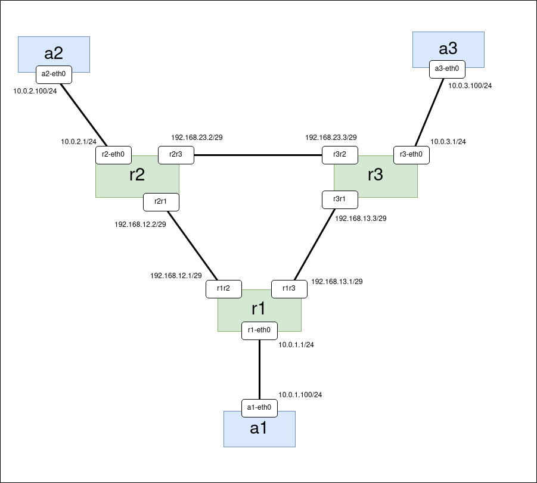

# Astra Linux mininet container

### Description

*Astra Linux (Orel)* distro is used as a base for docker container for *mininet* lab. Nodes with *Astra Linux* are used as routers with OSPF and RIP (*FRR* package).

Can be installed on a *Ubuntu* like host machine.

Files:

1. build-docker-image.sh (*Astra Linux* docker image builder)
2. example.py (*mininet* script)

```
git clone https://github.com/LovingFox/astra_mininet.git
cd astra_mininet
```

### Build an Astra Linux Docker container

#### Install packages

```
sudo apt-get update
sudo apt-get install -y docker.io debootstrap
```

#### Add current user to the group *docker*

```
sudo usermod -aG docker $USER
```

Have to re login to the system so that the changes come

#### Create a link to the script for Astra Linux Orel distro

```
sudo ln -s /usr/share/debootstrap/scripts/sid /usr/share/debootstrap/scripts/orel
```

#### Build an image

```
./build-docker-image.sh
```

The image *astra_linux_ce-frr:2.12* will be created with *FRR* package.

### Start mininet lab

Docker containers are launched by *containernet* (*mininet* fork)

#### Pull containernet

```
docker pull containernet/containernet
```

#### Run containernet

```
docker run --name containernet -it --rm --privileged --pid='host' \
   -v /var/run/docker.sock:/var/run/docker.sock \
   -v $(pwd):/host \
   containernet/containernet \
   python3 /host/example.py
```

The lab is created with three *Astra Linux* routers (r1, r2, r3) and three hosts connected to them (a1, a2, a3).



#### Login in to the lab node

To login in to any node open new terminal and type the command depended on node.

```
docker exec -it mn.r1 bash
docker exec -it mn.r2 bash
docker exec -it mn.r3 bash

docker exec -it mn.a1 bash
docker exec -it mn.a2 bash
docker exec -it mn.a3 bash
```

### Start OSPF

*FRR* configuration is typed commands via *vtysh* on every router r1, r2, r3 respectively.

**r1**

```
docker exec -it mn.r1 bash
vtysh
conf t
router ospf
 network 10.0.1.0/24 area 0
 network 192.168.12.0/29 area 0
 network 192.168.13.0/29 area 0
 exit
interface r1-eth0
 ip ospf passive
 exit
exit
```

**r2**

```
docker exec -it mn.r2 bash
vtysh
conf t
router ospf
 network 10.0.2.0/24 area 0
 network 192.168.12.0/29 area 0
 network 192.168.23.0/29 area 0
 exit
interface r2-eth0
 ip ospf passive
 exit
exit
```

**r3**

```
docker exec -it mn.r3 bash
vtysh
conf t
router ospf
 network 10.0.3.0/24 area 0
 network 192.168.23.0/29 area 0
 network 192.168.13.0/29 area 0
 exit
interface r3-eth0
 ip ospf passive
 exit
exit
```

#### OSPF test

Break the connection of a couple routers for a test. For example link r1-r3.

Open terminal a1 and start *ping* to a3:

```
docker exec -it mn.a1 bash
ping -O 10.0.3.100
```

In terminal *containernet>* break the linke r1-r3:

```
py net.configLinkStatus('r1','r3','down')
```

Ensure the connection a1 <-> a3 is broken but ping is continue successfully.

For recover link r1-r3 use this command:

```
py net.configLinkStatus('r1','r3','up')
```

#### vtysh commands for OSPF

```
show ip route
show ip route ospf
show ip ospf neighbor
show ip ospf route
```

### Start RIP

Stop *containernet>* (just type *exit*) and run it again the same command.

*FRR* for RIP:

**r1**

```
docker exec -it mn.r1 bash
vtysh
conf t
router rip
 network 10.0.1.0/24
 network 192.168.12.0/29
 network 192.168.13.0/29
 passive-interface r1-eth0
 exit
exit
```

**r2**

```
docker exec -it mn.r2 bash
vtysh
conf t
router rip
 network 10.0.2.0/24
 network 192.168.12.0/29
 network 192.168.23.0/29
 passive-interface r2-eth0
 exit
exit
```

**r3**

```
docker exec -it mn.r3 bash
vtysh
conf t
router rip
 network 10.0.3.0/24
 network 192.168.23.0/29
 network 192.168.13.0/29
 passive-interface r3-eth0
 exit
exit
```

Do tests the same way as for OSPF. It must be taken into account that the convergence of the RIP protocol is much slower and the restoration of connectivity after breaks will occur in a few seconds.

#### vtysh commands for RIP

```
show ip route
show ip route rip
show ip rip status
show ip rip
```
