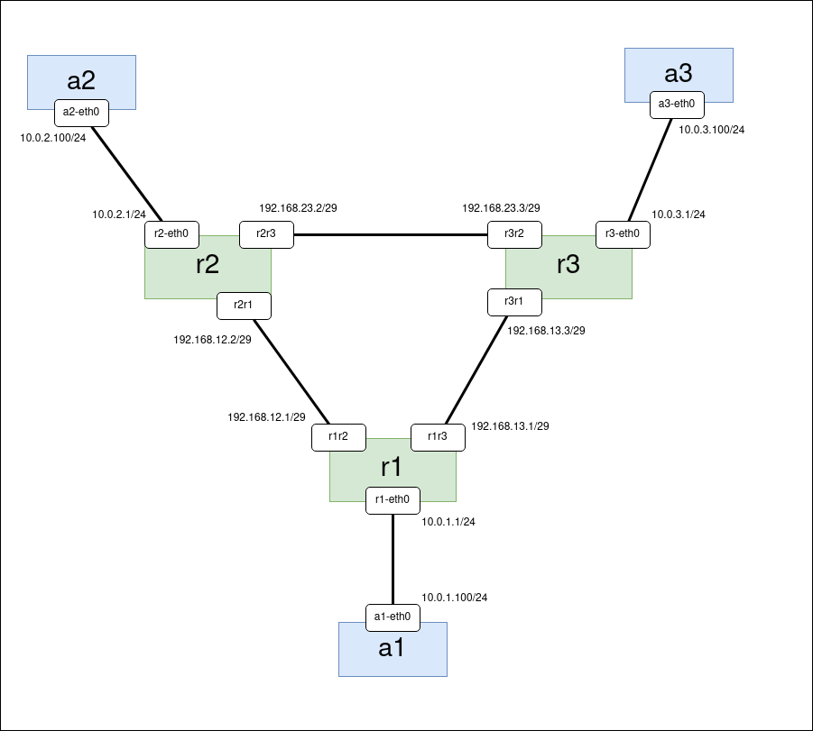

# Astra Linux mininet container

### Описание

Использование дистрибутива Astra Linux (Orel) в качестве основы для Docker контейнера на стенде mininet. Ноды с Astra Linux в mininet демонстрационного стенда используются в качестве маршрутизаторов с протоколами OSPF и RIP (на основе пакета FRR).

Инструкция может быть применена на хост-машине под управлением Ubuntu подобной ОС.

Необходимые файлы для работы:

```
build-docker-image.sh (для сборки контейнера Astra Linux)
example.py (для запуска стенда mininet)
```

### Сборка образа Astra Linux

#### Установка необходимых пакетов

```
sudo apt-get update
sudo apt-get install -y docker.io debootstrap
```

#### Добавление текущего пользователя в группу docker

```
sudo usermod -aG docker $USER
```

После этого нужно перелогиниться в систему.

#### Создание ссылки на скрипт для сборки редакции Orel

```
sudo ln -s /usr/share/debootstrap/scripts/sid /usr/share/debootstrap/scripts/orel
```

#### Сборка образа

```
./build-docker-image.sh
```

В результате работы скрипта будет создан образ astra_linux_ce-frr:2.12, содержащий Astra Linux и пакет FRR.

### Запуск mininet

Контейнеры Docker запускаются при помощи containernet (форк minint).

#### Скачивание образа containernet

```
docker pull containernet/containernet
```

#### Запуск образа containernet

```
docker run --name containernet -it --rm --privileged --pid='host' \
   -v /var/run/docker.sock:/var/run/docker.sock \
   -v $(pwd):/host \
   containernet/containernet \
   python3 /host/example.py
```

Будет создан стенд с тремя Astra Linux маршрутизаторами FRR и тремя хостами подключенными к ним.



#### Вход на устройства

Для входа на любое из устройств нужно открыть новый терминал и ввести одну из команд (в зависимости от устройства)

```
docker exec -it mn.r1 bash
docker exec -it mn.r2 bash
docker exec -it mn.r3 bash

docker exec -it mn.a1 bash
docker exec -it mn.a2 bash
docker exec -it mn.a3 bash
```

### Запуск OSPF

Конфигурация FRR вводится через консол vtysh на каждом из маршрутизаторов r1, r2, r3 соответственно.

**r1**

```
docker exec -it mn.r1 bash
vtysh
conf t
router ospf
 network 10.0.1.0/24 area 0
 network 192.168.12.0/29 area 0
 network 192.168.13.0/29 area 0
 exit
interface r1-eth0
 ip ospf passive
 exit
exit
```

**r2**

```
docker exec -it mn.r2 bash
vtysh
conf t
router ospf
 network 10.0.2.0/24 area 0
 network 192.168.12.0/29 area 0
 network 192.168.23.0/29 area 0
 exit
interface r2-eth0
 ip ospf passive
 exit
exit
```

**r3**

```
docker exec -it mn.r3 bash
vtysh
conf t
router ospf
 network 10.0.3.0/24 area 0
 network 192.168.23.0/29 area 0
 network 192.168.13.0/29 area 0
 exit
interface r3-eth0
 ip ospf passive
 exit
exit
```

#### Тест OSPF

Для проверки работы резервирования можно разорвать линк между парой маршрутизаторов. Например, между r1 и r3.

Открыть терминал a1 и запустить ping на a3:

```
docker exec -it mn.a1 bash
ping -O 10.0.3.100
```

В терминале *containernet>* разрвать линк r1-r3:

```
py net.configLinkStatus('r1','r3','down')
```

Убедиться, что связь a1 <-> a3 не разорвалась.

Восстановить линк r1-r3:

```
py net.configLinkStatus('r1','r3','up')
```

#### Команды vtysh для OSPF

```
show ip route
show ip route ospf
show ip ospf neighbor
show ip ospf route
```

### Запуск RIP

Остановить *containernet>* (просто ввести *exit*) и запустить его заново той же командой.

Конфигурация FRR для RIP:

**r1**

```
docker exec -it mn.r1 bash
vtysh
conf t
router rip
 network 10.0.1.0/24
 network 192.168.12.0/29
 network 192.168.13.0/29
 passive-interface r1-eth0
 exit
exit
```

**r2**

```
docker exec -it mn.r2 bash
vtysh
conf t
router rip
 network 10.0.2.0/24
 network 192.168.12.0/29
 network 192.168.23.0/29
 passive-interface r2-eth0
 exit
exit
```

**r3**

```
docker exec -it mn.r3 bash
vtysh
conf t
router rip
 network 10.0.3.0/24
 network 192.168.23.0/29
 network 192.168.13.0/29
 passive-interface r3-eth0
 exit
exit
```

Тесты можно провести точно так же, как для OSPF. Нужно учесть, что сходимость протокола RIP гораздо медленней и восстановление связи после разрывов будут происходить через несколько секунд.

#### Команды vtysh для RIP

```
show ip route
show ip route rip
show ip rip status
show ip rip
```
